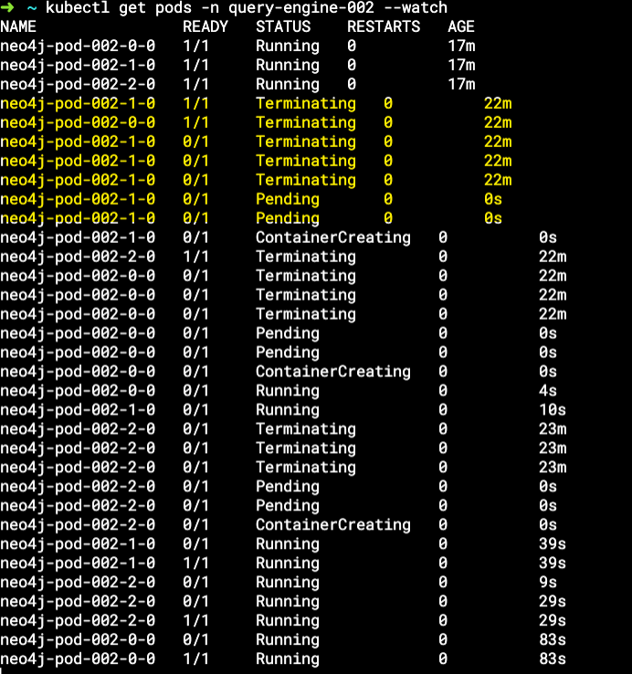

# Overview

This is an example project that deploys a Neo4J cluster on AWS using the upstream unmodified Neo4J helm chart to deploy multiple replicas (deploys one instance of Neo4J helm chart per replica) to demonstrate a violation of pod disruption budgets and loss of raft Quorum which will cause outages and writes to fail - this has the net impact of SLI Durability metric targets dropping under acceptable levels.

# Adjust variables

Adjust variables.tf for your environment - this example should work out of the box though.

# Deploying Neo4J Cluster
    terraform init --reconfigure

    terraform plan  

    terraform apply -auto-approve

# Watch pods

    kubectl get pods -n neo4j-test --watch

# Test breaking cluster quorum

Open a new terminal, but keep your other terminal open that's watching the pods.

Update a setting in: modules/neo4j_cluster_kubernetes/main.tf

Update:

    additional_labels = yamlencode({    
        role    = "primary",    
        project = var.deploy_config.project 
    })  

To:

    additional_labels = yamlencode({    
        role    = "primary",    
        project = var.deploy_config.project,    
        triggerchange = "true"  
    })  

Apply the changes:

    terraform apply -auto-approve

Observe the Neo4J cluster losing quorum as you apply the changes and watch the pods in terminal 1.

You should see a result similar to the following:

# Clean Up Resources

    terraform destroy -auto-approve

